# Fonts

Every font the desktop uses, one folder per family with its licence. `bootstrap.sh fonts` installs them
(Linux: `~/.local/share/fonts/personal-infra`, macOS: `~/Library/Fonts`).
Previews are `previews/FOLDER.png`, made by `uv run --with pillow --with fonttools fonts/preview.py`;
they are also on the website: <https://anissl93.github.io/personal-infra/#fonts>.

| Folder | Family | Used for | Original | Licence |
|---|---|---|---|---|
| `oldschool-pc/` | PxPlus IBM VGA 8x16 | Latin monospace everywhere (`font-preset pixel`), Obsidian code | [The Oldschool PC Font Resource](https://int10h.org/oldschool-pc-fonts/) | CC BY-SA 4.0 |
| `cubic-11/` | Cubic 11 | Chinese (`font-preset pixel`) | [ACh-K/Cubic-11](https://github.com/ACh-K/Cubic-11) | OFL 1.1 |
| `starlove-pencil/` | StarLovePencil (宅在家自動筆) | Chinese (`font-preset bubble`) | [天天宅在家 on Bahamut](https://home.gamer.com.tw/creationDetail.php?sn=4470108) | free to use, modify, embed (`LICENSE.txt`) |
| `fuzzy-bubbles/` | Fuzzy Bubbles | Emacs variable-pitch, Obsidian | [Google Fonts](https://fonts.google.com/specimen/Fuzzy+Bubbles) | OFL 1.1 |
| `fuzzy-bubbles-mono/` | Fuzzy Bubbles Mono | Latin monospace (`font-preset bubble`) | made from Fuzzy Bubbles by `mono.py` | OFL 1.1 |
| `typicons/` | typicons | dwm status bar icons | [stephenhutchings/typicons.font](https://github.com/stephenhutchings/typicons.font) | OFL 1.1 |
| `symbols-nerd-font/` | Symbols Nerd Font Mono | dwm tag and app icons | [ryanoasis/nerd-fonts](https://github.com/ryanoasis/nerd-fonts) | MIT |
| `zcool-kuaile/` | ZCOOL KuaiLe | Obsidian Chinese fallback | [Google Fonts](https://fonts.google.com/specimen/ZCOOL+KuaiLe) | OFL 1.1 |
| `ma-shan-zheng/` | Ma Shan Zheng | Obsidian Chinese fallback | [Google Fonts](https://fonts.google.com/specimen/Ma+Shan+Zheng) | OFL 1.1 |
| `long-cang/` | Long Cang | Obsidian Chinese fallback | [Google Fonts](https://fonts.google.com/specimen/Long+Cang) | OFL 1.1 |
| `press-start-2p/` | Press Start 2P | Obsidian UI fallback | [Google Fonts](https://fonts.google.com/specimen/Press+Start+2P) | OFL 1.1 |

## Previews

**PxPlus IBM VGA 8x16** · [original](https://int10h.org/oldschool-pc-fonts/)
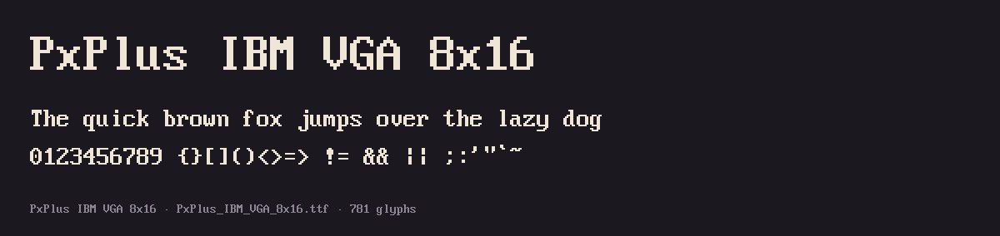

**Cubic 11** · [original](https://github.com/ACh-K/Cubic-11)
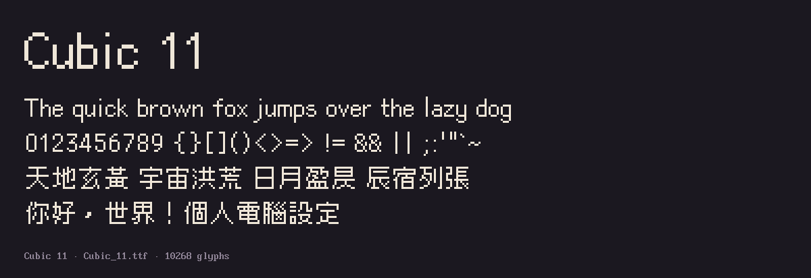

**StarLovePencil (宅在家自動筆)** · [original](https://home.gamer.com.tw/creationDetail.php?sn=4470108)
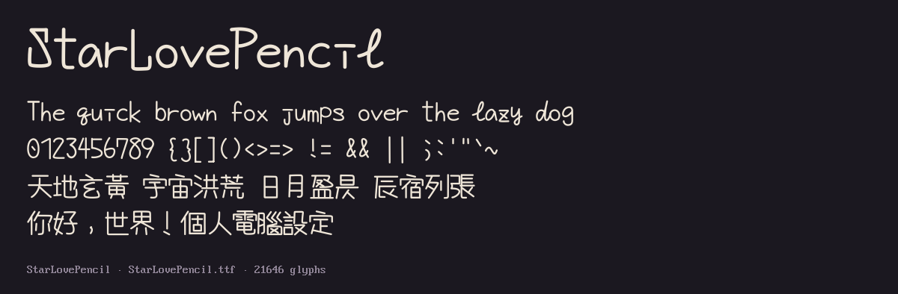

**Fuzzy Bubbles** · [original](https://fonts.google.com/specimen/Fuzzy+Bubbles)
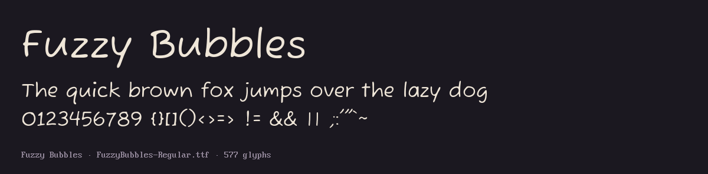

**Fuzzy Bubbles Mono** · made from Fuzzy Bubbles by `fuzzy-bubbles-mono/mono.py`
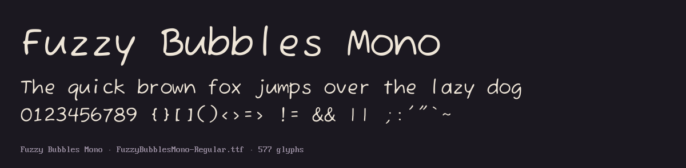

**typicons** · [original](https://github.com/stephenhutchings/typicons.font) (first row: the status-bar icons)
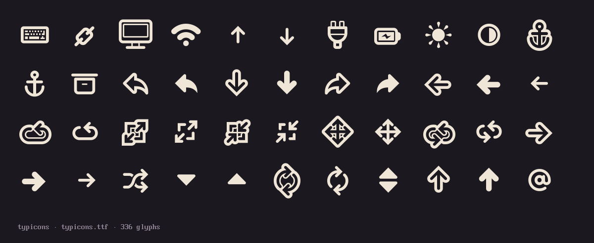

**Symbols Nerd Font Mono** · [original](https://github.com/ryanoasis/nerd-fonts) (first rows: the dwm tag and app icons)
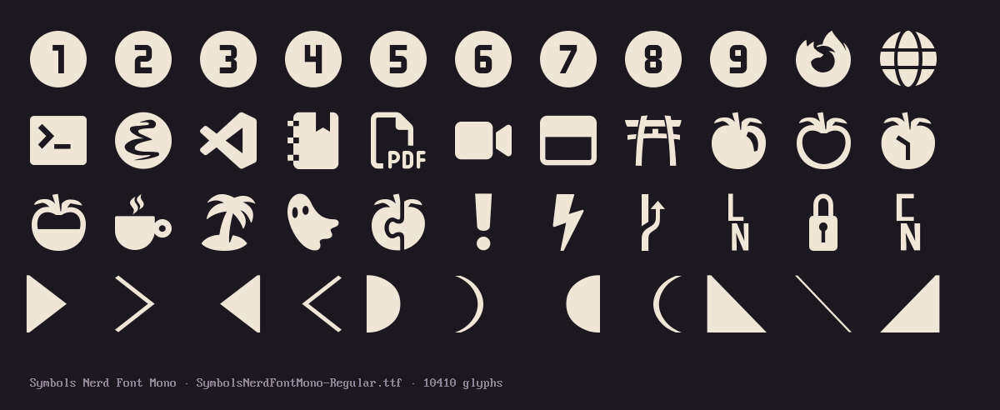

**ZCOOL KuaiLe** · [original](https://fonts.google.com/specimen/ZCOOL+KuaiLe)
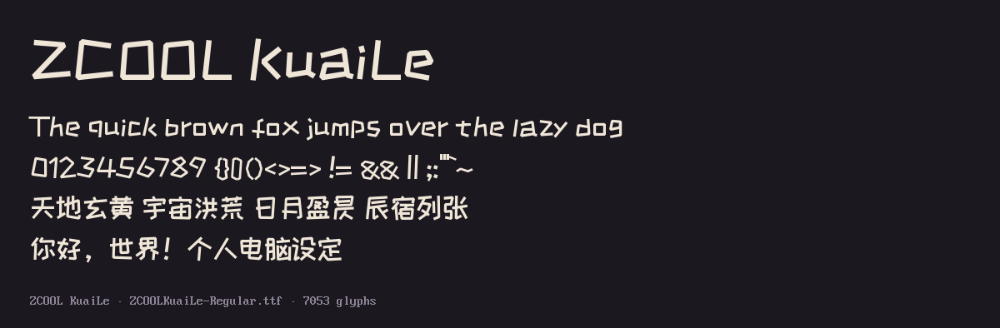

**Ma Shan Zheng** · [original](https://fonts.google.com/specimen/Ma+Shan+Zheng)
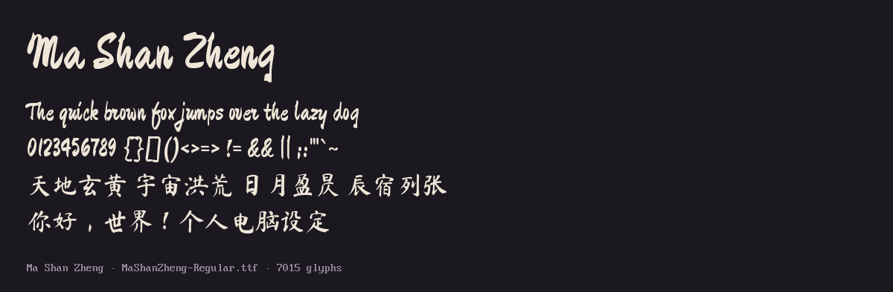

**Long Cang** · [original](https://fonts.google.com/specimen/Long+Cang)
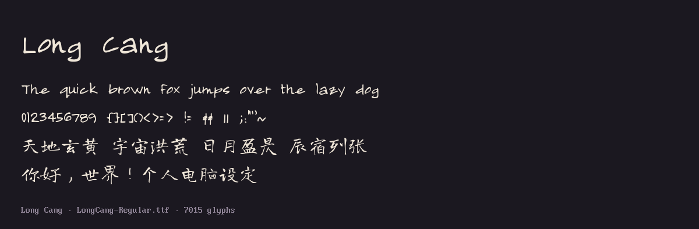

**Press Start 2P** · [original](https://fonts.google.com/specimen/Press+Start+2P)
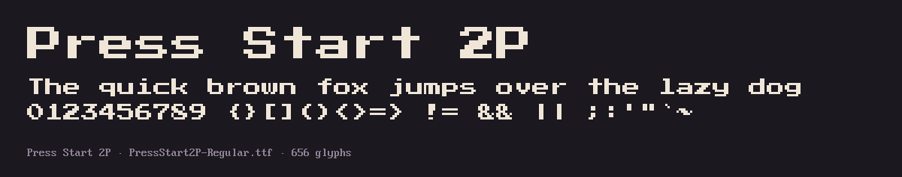
